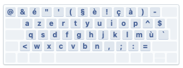
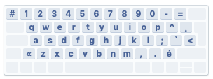
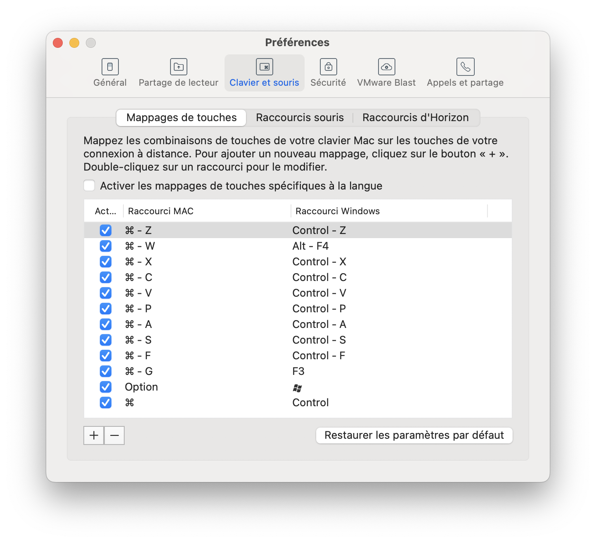

# karabiner-vdi
Fichier de configuration pour [Karabiner-Elements](https://github.com/pqrs-org/Karabiner-Elements).

Cette configuration correspond à un besoin très spécifique de pouvoir utiliser le clavier d'un MacBook Pro AZERTY Français lorsque connecté à une infrastructure de bureau virtuel (VDI) Windows où la seule méthode de saisie possible est le QWERTY Français Canadien.

Le remapping n'est appliqué uniquement lors de la saisie dans VMware Horizon Client.   

| Clavier physique                                | Clavier virtuel                                |
|-------------------------------------------------|------------------------------------------------|
|  |  |

Configuration recommandé du clavier dans les paramètres de VMware Horizon Client

> [!IMPORTANT]  
> Configuration fournie telle-quelle
> - Aucun support.
> - Des mappages peuvent manquer (caractères spéciaux notamment).
> -  Le mappage des touches <kbd>@#</kbd> et <kbd><></kbd> est inversé lorsque le profil est activé et VMWare Horizon n'est pas au premier plan.
> - Le profil de configuration consiste en une seule et unique règle, les mappages ne sont pas séparés en sous-règles (=désordre).
